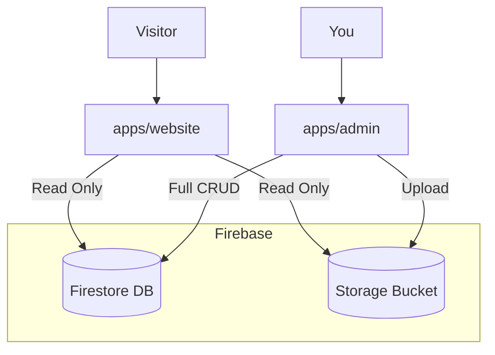

# Portfolio Monorepo

A modern, bilingual portfolio website ecosystem with a public-facing site and a private content management system. Built with **Next.js 16**, **TypeScript**, **Firebase**, and **Tailwind CSS 4**.


---

## 🌐 Live Demo

Check out the live portfolio at **[nuraydin.com](https://nuraydin.com)** to see it in action!

---

## 🎯 Project Philosophy

This portfolio is designed to be **"Agentic-First"** and **AI-Native**. It serves as a living proof of concept for:
- **Technical Product Management**: Clean architecture, scalable systems.
- **AI Integration**: Prepared for future agentic workflows.
- **Global Reach**: First-class bilingual support (Turkish/English).
- **Polished Authenticity**: A design system that is bold, playful, and minimalist.

**Feel free to fork this project and make it your own!** No attribution required—use it however you'd like. 🚀

---

## 🏗️ Architecture

The project is structured as a **Monorepo** using npm workspaces.



### Applications

| App | Path | Port | Description |
|-----|------|------|-------------|
| **Website** | [`apps/website`](./apps/website) | `:3000` | Public portfolio. Server Components, i18n, Analytics. |
| **Admin** | [`apps/admin`](./apps/admin) | `:3001` | Private CMS. Secure, Server Actions, Drag-n-Drop. |

---

## 🚀 Quick Start

### 1. Clone & Install
```bash
git clone https://github.com/meanllbrl/portfolio.git
cd portfolio
npm install
```

### 2. Environment Setup
You need a Firebase project. Create one at [console.firebase.google.com](https://console.firebase.google.com).

**Website:**
```bash
cd apps/website
cp env.example .env.local
# Add your Firebase Config keys
```

**Admin:**
```bash
cd apps/admin
cp env.example .env.local
# Add Firebase Config + Admin Service Account Key
```

### 3. Run Development Servers
From the **root** directory:

| Command | Action |
|---------|--------|
| `npm run dev:website` | Starts the **Website** at `localhost:3000` |
| `npm run dev:admin` | Starts the **Admin** at `localhost:3001` |
| `npm run build` | Builds both apps |

---

## 🛠️ Tech Stack

### Core
- **Framework**: [Next.js 16](https://nextjs.org/) (App Router)
- **Language**: [TypeScript](https://www.typescriptlang.org/)
- **Styling**: [Tailwind CSS 4](https://tailwindcss.com/)
- **Database**: [Firebase Firestore](https://firebase.google.com/products/firestore)
- **Storage**: [Firebase Storage](https://firebase.google.com/products/storage)

### Website Specifics
- **i18n**: [`next-intl`](https://next-intl-docs.vercel.app/) (Middleware-based routing)
- **Content**: [`react-markdown`](https://github.com/remarkjs/react-markdown), `remark`, `rehype`
- **Theming**: `next-themes` (Dark/Light mode)

### Admin Specifics
- **Forms**: `react-hook-form` + `zod` validation
- **UI**: `shadcn/ui` (Radix Primitives)
- **Interactivity**: `@dnd-kit` (Drag & Drop reordering)
- **Security**: `firebase-admin` (Server-side privileged access)

## 📚 Documentation

Detailed documentation for different aspects of the project can be found in the [`docs/`](./docs) folder:

| Document | Description |
|----------|-------------|
| [**Data Structures**](./docs/DATA_STRUCTURES.md) | Firestore collections, document schemas, and TypeScript interfaces. |
| [**Style Guide**](./docs/STYLE_GUIDE.md) | Design system, color palettes, and UI components standards. |
| [**PRD**](./docs/PRD.md) | Product Requirements Document and strategic vision. |

---

## 📂 Project Structure

```
portfolio/
├── apps/
│   ├── website/           # Public Frontend
│   │   ├── app/[locale]/  # i18n Routes
│   │   ├── content/       # Blog Markdown files
│   │   └── messages/      # Translation JSONs
│   │
│   └── admin/             # Private CMS
│       ├── app/           # Dashboard Routes
│       └── lib/           # Admin SDK logic
│
├── docs/                  # Documentation
│   ├── DATA_STRUCTURES.md # DB Schema
│   ├── PRD.md             # Product Strategy
│   └── STYLE_GUIDE.md     # Design System
│
└── package.json           # Workspaces config
```

---

## 🔒 Security Model

1.  **Firestore Rules**: Lock down **writes** completely for most collections. Allow public **creation** only for the `recommendations` collection (as drafts).
2.  **Admin SDK**: The Admin app uses a Service Account Key (server-side) to bypass Firestore rules, granting full control.
3.  **Safety**: 
    - Never expose the `FIREBASE_ADMIN_SDK_KEY` in client-side code.
    - The Admin app is designed to be run locally or behind strict authentication.

### Recommended Firestore Rules
```javascript
rules_version = '2';
service cloud.firestore {
  match /databases/{database}/documents {
    // Public Read-Only Collections
    match /projects/{doc=**} { allow read: if true; }
    match /posts/{doc=**} { allow read: if true; }
    match /experiences/{doc=**} { allow read: if true; }
    match /educations/{doc=**} { allow read: if true; }
    match /achievements/{doc=**} { allow read: if true; }
    match /settings/{doc=**} { allow read: if true; }

    // Recommendations System
    match /recommendations/{id} {
      allow read: if resource.data.status == 'published';
      allow create: if request.resource.data.status == 'draft'
                    && request.resource.data.name is string
                    && request.resource.data.thought is string;
      allow update, delete: if false; // Handled by Admin SDK
    }
  }
}
```

### Recommended Firebase Storage Rules

**⚠️ Important**: The following rules allow public read access to all files. If public read access is a security concern for your use case, you should update these rules accordingly.

```javascript
rules_version = '2';
service firebase.storage {
  match /b/{bucket}/o {
    match /{allPaths=**} {
      allow read: if true;
      allow write: if false;
    }
  }
}
```

---

## 📄 License

[MIT](./LICENSE)
